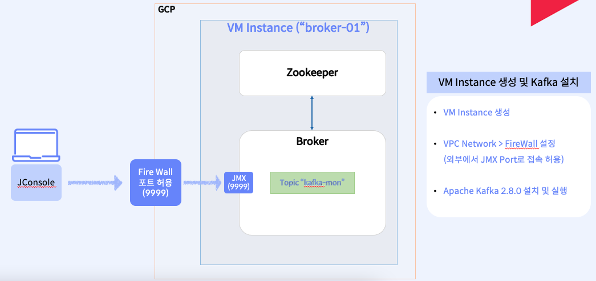

# GCP에서 Apache Kafka 설치 및 실행하기
- GCP(Google Cloud Platform)에서 VM 서버를 생성하고, apache kafka를 설치 및 실행한다. 



## STEP 0. Connect to vm server using ssh
- "broker-01" 서버로 접속한 후, 아래의 명령어를 순서대로 실행한다. 

## STEP1. Install the apache kafka 2.8.0 on gcp vm instance

### Java 설치 및 JAVA_HOME 설정
```
> sudo yum install -y java

# 현재 OS 설정이 한글인지 영어인지 확인한다. 
> alternatives --display java

# 아래와 같이 출력되면 한글임. 
슬레이브 unpack200.1.gz: /usr/share/man/man1/unpack200-java-1.8.0-openjdk-1.8.0.312.b07-1.el7_9.x86_64.1.gz
현재 '최고' 버전은 /usr/lib/jvm/java-1.8.0-openjdk-1.8.0.312.b07-1.el7_9.x86_64/jre/bin/java입니다.

### 한글인 경우 
> alternatives --display java | grep '현재 /'| sed "s/현재 //" | sed 's|/bin/java로 링크되어 있습니다||'
> export JAVA_HOME=$(alternatives --display java | grep '현재 /'| sed "s/현재 //" | sed 's|/bin/java로 링크되어 있습니다||')

### 영문인 경우
> alternatives --display java | grep current | sed 's/link currently points to //' | sed 's|/bin/java||' | sed 's/^ //g'
> export JAVA_HOME=$(alternatives --display java | grep current | sed 's/link currently points to //' | sed 's|/bin/java||' | sed 's/^ //g')

# 제대로 java 경로가 설정되었는지 확인
> echo $JAVA_HOME
> echo "export JAVA_HOME=$JAVA_HOME" >> ~/.bash_profile
> source ~/.bash_profile
```

### Download apache kafka
```
> cd ~
> curl -O https://archive.apache.org/dist/kafka/2.8.0/kafka_2.12-2.8.0.tgz 
> tar xvf kafka_2.12-2.8.0.tgz
> rm -rf kafka_2.12-2.8.0.tgz
> cd kafka_2.12-2.8.0
```

### Run apache zookeeper & kafka
#### Run zookeeper
```
> cd ~/kafka_2.12-2.8.0

# 1) Foreground 실행 (테스트 용으로 zookeeper 로그를 직접 확인)
> bin/zookeeper-server-start.sh config/zookeeper.properties

# 2) Background 실행
> bin/zookeeper-server-start.sh -daemon config/zookeeper.properties
> ps -ef | grep zookeeper

```

#### Run kafka broker
```
> cd ~/kafka_2.12-2.8.0
## producer 또는 consumer에서 broker에 접속할 때 사용 가능한 hostname 설정 
> vi config/server.properties
advertised.listeners=PLAINTEXT://broker-01:9092

## java.rmi.server.hostname은 본인의 외부 IP로 변경
### rmi.server.hostname을 설정해야, 외부의 jconsole과 같은 도구에서 접속 가능
> export KAFKA_JMX_OPTS='-Dcom.sun.management.jmxremote -Dcom.sun.management.jmxremote.authenticate=false 
  -Dcom.sun.management.jmxremote.ssl=false 
  -Dcom.sun.management.jmxremote.port=9999 
  -Dcom.sun.management.jmxremote.rmi.port=9999 
  -Djava.rmi.server.hostname=34.64.179.85'

# 1) Foregroud 
> env JMX_PORT=9999 bin/kafka-server-start.sh config/server.properties

# 2) background 실행
> env JMX_PORT=9999 bin/kafka-server-start.sh -daemon config/server.properties
```

#### Creeate a topic(kafka-mon)
```
> cd ~/kafka_2.12-2.8.0
> bin/kafka-topics.sh --create --bootstrap-server localhost:9092 --topic kafka-mon \
--partitions 2 --replication-factor 1

# 생성된 topic 확인
> bin/kafka-topics.sh --list --bootstrap-server localhost:9092 
kafka-mon
```


## STEP2. Check the broker metrics using the JConsole
- JDK가 설치된 노트북에 아래 명령어 실행. 
```
> jconsole
```
