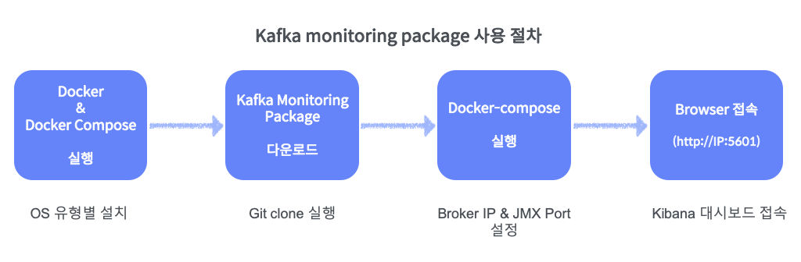
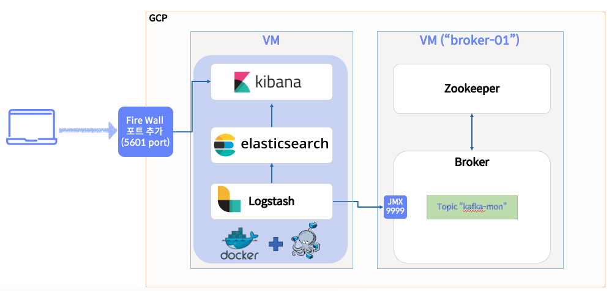

# Docker packages for easy monitoring of kafka brokers at one-click 

- 클릭 한번으로 kafka broker/producer/consumer의 jmx metric을 수집/저장/시각화 가능한 docker package.

### 언제 사용할까?
- Kafka를 다양한 환경(로컬, 개발서버, 운영서버 등)에서 설치 및 운영하다 보면,
- Broker, Producer, Consumer 등의 성능, 안정성 등의 지표를 확인해야 하는 상황이 많이 발생한다
- 하지만, 매번 이를 위해서 매번 jmx metric을 수집하기 위해서 
  - 모든 필요한 프로그램을 설치하고, 
  - 각 SW별 환경 설정을 변경/추가하고,
  - 수집할 jmx metric에 대한 설정을 추가하는 것은 생각보다 많은 시간이 소요된다 (막상 해보면 갑자기 안되는 경우도 많고...)
- 본 docker package는 위와 같은 절차를 docker라는 컨테이너 환경으로 가상화하여,
  - 어떤 환경에서든 명려어 한번(docker-compose up)으로 쉽게 설치 및 실행가능하다.
- 즉,
  - 원하는 broker, producer, consumer의 ip, jmx port를 확인하여,
  - 수집할 jmx metric만 선택하면, 
  - 자동으로 jmx metric을 수집/저장/시각화하여 모니터링이 가능함. 

### 설치 및 사용 절차
- Docker-compose로 제공되는 elastic stack을 활용하여, 다수의 kafka broker에서 제공하는 jmx metric을 빠르게 수집할 환경 구성
- 전체 과정은 docker-compose up 실행 한번으로 구동 가능 
- broker의 ip(hostname)만 설정하면, 자동으로 기본 jmx metric을 수집하여 elasticsearch에 저장
  - 수집할 jmx metric은 업무별로 추가/삭제 가능
- 사용자는 kibana에 접속하여 기본 dashboard를 이용하여 모니터링 가능 (각 업무별로 시각화 추가/변경 가능)
- elastic stack을 구성하는 기본 docker-compose 설정은 docker-elk(https://github.com/deviantony/docker-elk)를 활용함. 



### 모니터링 환경 구성도
- 위 docker package를 설치하면 아래와 같은 모니터링 환경이 구성된다. 
  - 
- Docker 기반으로 3개의 서비스(elasticsearch, kibana, logstash)를 실행하고, 
- logstash에서 kafka metric을 수집하여
- elasticsearch로 저장한 후,
- kibana에서 미리 생성된 dashboard를 통해서 메트릭 정보를 확인한다. 

## STEP 1. 시스템 환경 설정 
- docker-compose가 사전에 설치되어 있어야 함. 
- Host(Server) 최소 구성요건
```
Docker Engine version 17.05 or newer
Docker Compose version 1.20.0 or newer
RAM : 1.5 GB of RAM
```
- 본 docker-compose package를 설치할 서버로 접속하여, 아래 절차를 수행한다. 

### Install doker engine 
- Docker 홈 페이지에서 가이드 하는 순서대로 설치 진행 
- https://docs.docker.com/engine/install/centos/
```
> sudo yum remove docker \
                  docker-client \
                  docker-client-latest \
                  docker-common \
                  docker-latest \
                  docker-latest-logrotate \
                  docker-logrotate \
                  docker-engine

> sudo yum install -y yum-utils

> sudo yum-config-manager \
    --add-repo \
    https://download.docker.com/linux/centos/docker-ce.repo

> sudo yum install -y docker-ce docker-ce-cli containerd.io
> sudo systemctl start docker
> sudo systemctl enable docker

# 설치된 docker version 확인 
> sudo docker version
Client: Docker Engine - Community
 Version:           20.10.12

Server: Docker Engine - Community
 Engine:
  Version:          20.10.12

# docker 실행시 사용자 권한으로 실행하기 위한 권한 변경
# 아래 명령어 실행 후 콘솔을 재시작 해야 함. (로그아웃 후 다지 접속)
> sudo usermod -aG docker user_id
```

### Install docker-compose
- https://docs.docker.com/compose/install/
```
> cd ~
> sudo curl -L "https://github.com/docker/compose/releases/download/1.29.2/docker-compose-$(uname -s)-$(uname -m)" -o /usr/local/bin/docker-compose
> sudo chmod +x /usr/local/bin/docker-compose
> docker-compose --version
docker-compose version 1.29.2, build 5becea4c
```

## STEP 2. kafka broker의 jmx metric 수집하기
### Broker가 실행중인 서버의 ip 또는 Hostname으로 변경 
```
> sudo yum install -y git 
> cd ~
> git clone https://github.com/freepsw/kafka-metrics-monitoring.git
> cd ~/kafka-metrics-monitoring/kafka_monitoring_package/docker-elk

# Broker 접속을 위한 ip/hotname 변경 
> vi logstash/pipeline/jmx_conf/broker01.conf
## 아래 정보 중 host 정보를 본인이 운영중인 broker 서버의 ip 또는 hostname으로 변경한다. 
  "host" : "broker-01",
  "port" : 9999,
  ...
```
- broker가 2대(broker-01, broker-02) 서버로 구성되어 있고, 이를 모니터링하려면, 
- broker02.conf로 새로운 파일을 생성하고, "host", "port"를 추가한 broker정보에 맞게 변경해 준다. 

### JMX metric 수집하기
- Docker image(elasticsearch, kibana, logstash)를 build하고 시간이 소요됨. (NW 성능에 따라 5분 이상 소요)
- docker image가 build되면, 각 프로그램들을 실행하며, logstash에서 kafka broker에 접속하여 jmx metric을 수집한다. 
```
> cd ~/kafka-metrics-monitoring/kafka_monitoring_package/docker-elk
> docker-compose up

### 아래와 같은 메세지가 출력되면 정상적으로 데이터를 수집하는 것임. 
logstash_1       | {
logstash_1       |                "@version" => "1",
logstash_1       |                    "host" => "broker-01",
logstash_1       |              "@timestamp" => 2022-01-20T01:38:35.710Z,
logstash_1       |                    "path" => "/usr/share/logstash/pipeline/jmx_conf",
logstash_1       |                    "type" => nil,
logstash_1       |             "metric_path" => "broker01.ReplicaManager.UnderReplicatedPartitions.Value",
logstash_1       |     "metric_value_number" => 0
logstash_1       | }
```
- 위 단계는 3개의 docker image를 다운로드 과정이 포함됨 
- 따라서 NW 속도에 따라 시간이 많이 소요될 수 있음. (GCP 환경에서 실행시 약 7뷴 소요)

## STEP 3. Kibana 시각화를 위한 설정 
- Kibana web ui에서 실행할 수도 있으나, console에서 빠르게 필요한 명령어 실행 가능
### Import kibana dashboard for kafka (사전에 생성된 kafka broker 모니터링용 dashboard)
```
> cd ~/kafka-metrics-monitoring/kafka_monitoring_package
> curl --user elastic:changeme -X POST "localhost:5601/api/saved_objects/_import" -H "kbn-xsrf: true" --form file=@kibana_object/kibana_kafka_dashboard.ndjson
```

## STEP 4. Kibana Web UI 접속 (dashboard 확인)
- Browser에서 <Mointoring 서버 IP>:5601로 접속
  - id : elastic
  - password : changeme 


## STEP 5. Stop docker-compose
- 모니터링을 종료하고, docker를 중지하려면 아래 명령어 실행 
```
> docker-compose down

# 기존에 실행되었던 container image의 volume 데이터까지 삭제하려면, -v 옵션을 추가
# 이 경우, elasticsearch에 수집된 metric 데이터와 kibana의 그래프(차트, 대시보드)도 삭제된다.
> docker-compose down -v
```

## ETC - 추가 설명 

### Producer, Consumer의 JMX metric을 수집하려면?
- logstash에서 jmx 설정을 읽어오는 디렉토리에 consumer, producer용 jmx 수집설정 파일을 생성한다. 

```
> cd ~/kafka-metrics-monitoring/kafka_monitoring_package/
> ls docker-elk/logstash/pipeline/jmx_conf/
broker01.conf  broker02.conf
```

### 기본 패스워드 변경 
-  https://github.com/deviantony/docker-elk#how-to-reset-a-password-programmatically 참고
```
>  curl -XPOST -D- 'http://localhost:9200/_security/user/elastic/_password' \
    -H 'Content-Type: application/json' \
    -u elastic:<your current elastic password> \
    -d '{"password" : "<your new password>"}'
```

### Java JVM 설정 변경
- https://github.com/deviantony/docker-elk#jvm-tuning
- docker-compose.yml 설정 파일에서 수정 가능
```yml
logstash:

  environment:
    LS_JAVA_OPTS: -Xmx1g -Xms1g
```

### 강제로 모든 docker image 삭제하기
- 현재 서버의 모든 docker image가 삭제되므로, 주의해서 사용
```
> docker rmi -f $(docker images -q)
```

### 기반이 되는 github 프로젝트
- 본 코드는 docker-elk라른 github 코드에서 jmx 설정 및 라이센스 관련 부분을 수정하여 구성됨
- docker-elk는 github에 공개된 elastic stack 설치 스크립트
  - 최신 elastic stack을 설치해 주며, basic 또는 trial(상용 30일 무료) license를 적용하여 실행 가능
  - 본 스크립트에서는 기본으로 basic으로 실행 (elasticsearch/config/elasticsearch.yml)
  - https://github.com/deviantony/docker-elk 참고 

#### 주요 변경 코드
- elasticsearch license 변경 : elasticsearch/config/elasticsearch.yml
  - trial --> basic
  - xpack.security.enabled: false (elasticsearch에 다른 application도 쉽게 접속 할 수 있도록)
- logstash plugin 설치 : logstash/Dockerfile
  - RUN logstash-plugin install logstash-input-jmx
- logstash broker jmx 설정 추가
  - logstash/pipeline/jmx_conf : 수집할 jmx metric 
  - logstash/pipeline/logstash_jmx.conf : jmx metric을 수집하여 elasticsearch에 저장하는 pipeline 설정

### Elastic stack version 변경은?
- 원하는 elastic stack 버전으로 실행하려면, 
- github의 branch(https://github.com/deviantony/docker-elk/branches)에서 원하는 버전을 선택하여, git clone을 한다. 
  - 현재 권장하는 버전은 7.x, 6.x 버전이다. 
- 다른 방식으로는 
  - 1) .env에서 ELK_VERSION=7.16.2로 지정된 버전을 직접 변경하는 방법
  - 2) 각 제품의 Dockerfile에서 직접 버전을 지정하는 방법
       - 이 방식은 제품간의 버전 차이가 발생하면, 호환성 문제 등 사용자가 직접 모든 부분을 해결해야 한다. 